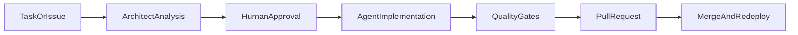

# AI Fabric

AI Fabric is a delivery orchestration layer for software teams running on Gitea.
It turns issue flow into controlled automation: plan -> implement -> validate -> review.

## Purpose

- Keep planning, execution, and review inside one auditable delivery system.
- Automate repetitive delivery work while preserving explicit human decision points.
- Enforce quality gates before integration (`fmt`, `lint`, `test`, policy checks).
- Standardize issue-to-PR execution with reproducible workflows.

## How It Works

- Source of truth is Gitea (issues, branches, PRs, workflows).
- Delivery automation operates through repository workflows and policy scripts.
- Runtime stack is being migrated to Go-first services and tooling.

## Core Use Cases

- **Assisted Delivery**: convert backlog issues into implementation-ready PRs.
- **Policy Enforcement**: block low-quality changes with deterministic checks.
- **Operational Traceability**: keep decisions, changes, and validation in one place.
- **Self-Hosted Workflow Control**: run the full loop on local/private infrastructure.

## Documentation Map

- Project docs index: [`docs/README.md`](docs/README.md)
- Architecture: [`docs/architecture/ai-fabric-poc.md`](docs/architecture/ai-fabric-poc.md)
- CI/CD policy: [`docs/workflows/ci-cd.md`](docs/workflows/ci-cd.md)
- Issue automation flow: [`docs/workflows/issue-handler.md`](docs/workflows/issue-handler.md)
- PR workflow rules: [`docs/workflows/pr-best-practices.md`](docs/workflows/pr-best-practices.md)
- Agent operating rules: [`docs/skills/agent-guidelines.md`](docs/skills/agent-guidelines.md)

## Repository Layout

- `cmd/` application entrypoints
- `pkg/` reusable domain and system packages
- `bin/` operational scripts and policy gates
- `docs/` architecture, workflows, skills, and plans
- `.gitea/workflows/` CI pipelines
- `var/` runtime-only state (not source context)
