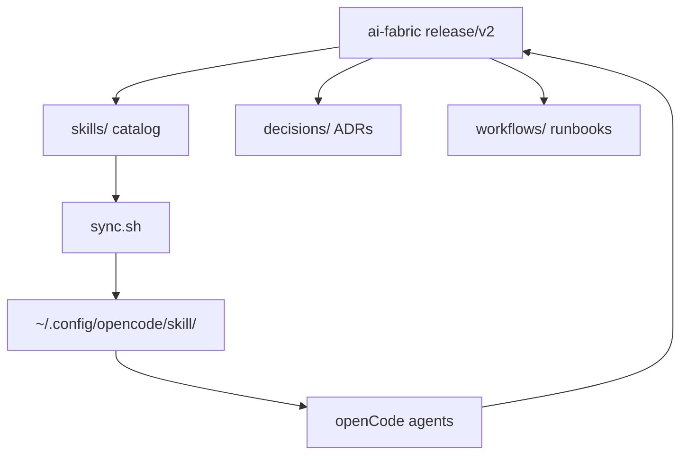

# AI Fabric

**Single public source of truth for decisions, workflows, and agent skills.**

This repository (branch `release/v2`) deliberately contains **no application
code**. The Go-based software-delivery fabric (`cmd/`, `pkg/`, `internal/`,
`Dockerfile`, docker-compose, CI workflow) was stripped so this branch stays
purely for **decisions, workflows, and skills** and their **reuse across
systems**.


```mermaid
graph TD
  Fabric[ai-fabric release/v2] --> S[skills/ catalog]
  Fabric --> D[decisions/ ADRs]
  Fabric --> W[workflows/ runbooks]
  S --> Sync[sync.sh]
  Sync --> Opencode[~/.config/opencode/skill/]
  Opencode --> Agents[openCode agents]
  Agents --> Fabric
```

## What lives here

- **`decisions/`** — Architecture Decision Records (ADRs) and accepted plans.
  Read [`decisions/README.md`](decisions/README.md) for the ADR format.
- **`workflows/`** — reusable process runbooks (CI/CD, issue-handler, PR
  best-practices, monitoring, backup-restore, e2e-poc-validation,
  python-to-go-migration). Read [`workflows/README.md`](workflows/README.md).
- **`skills/`** — the consolidated skill catalog. Each skill is a subdir with a
  `SKILL.md` (+ aux files) and opencode-compatible frontmatter
  (`name:`/`description:`). Read [`skills/README.md`](skills/README.md).
- **`sync.sh`** — idempotent installer that distributes all skills from
  `skills/` into a target opencode skills directory.
- **`AGENTS.md`** — agent-facing guide to this repo.

## Using skills across systems

Skills are portable and installed by `sync.sh`. It copies every skill subdir
under `skills/` into `~/.config/opencode/skill/<name>/` (override with
`--target`), creating dirs as needed and mirroring deletions via rsync
`--delete`.

```bash
# preview what would change, write nothing
./sync.sh --dry-run

# install / refresh all skills into the default target
./sync.sh

# install into a custom directory
./sync.sh --target /some/other/skills
```

`sync.sh` is idempotent — safe to run any time. Use `--dry-run` first to
confirm the change set. It logs each skill it syncs.

### Installing skills

Skills are updated **only** here, never in their installed locations. Workflow:

1. Edit a skill in `skills/<name>/`.
2. Run `./sync.sh` to propagate.
3. Commit here on `release/v2`.

Removing a skill from the catalog also removes it from the target on the next
`sync.sh`.

## Core use cases

- **Consolidated skills**: one public catalog, no duplicate skills across
  repos (dedup decisions recorded in `skills/README.md`).
- **Portable workflows & decisions**: runbooks and ADRs that any project or
  system can adopt.
- **Reuse across systems**: `sync.sh` pushes the catalog into any opencode
  installation, making every agent see the same skills.

## Repository layout

```
AGENTS.md                 agent guide
README.md                 this file
CODEOWNERS                ownership policy
.gitignore / .ignore      hygiene
decisions/                ADRs, accepted plans, reference sources
workflows/                process runbooks
skills/                   single consolidated skill catalog
sync.sh                   skill distribution script
```
